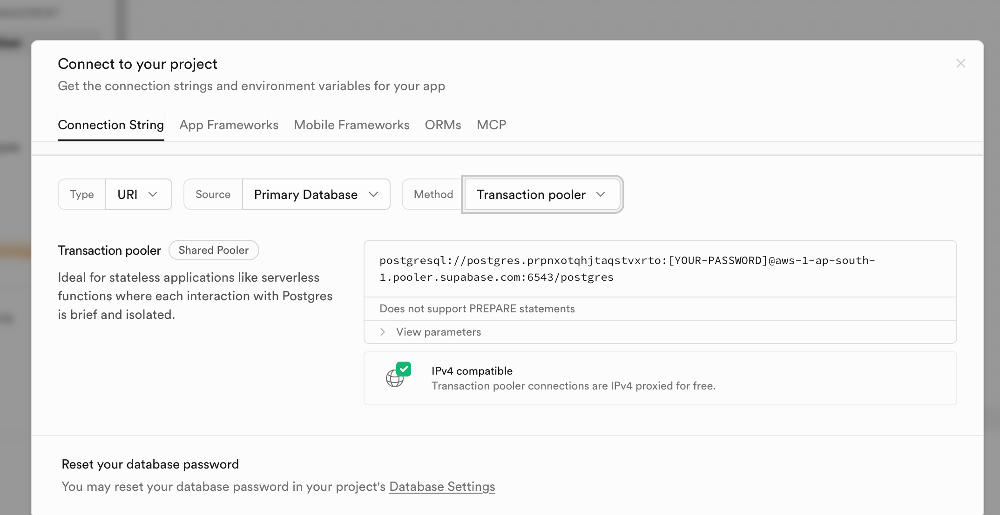
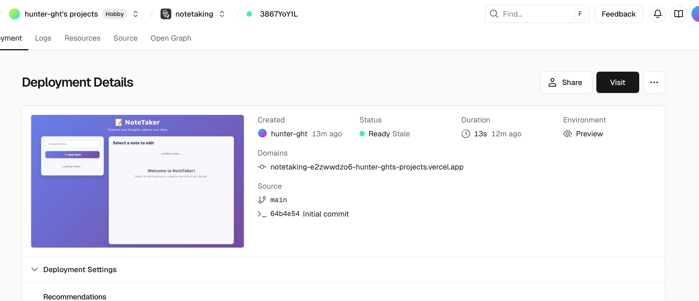
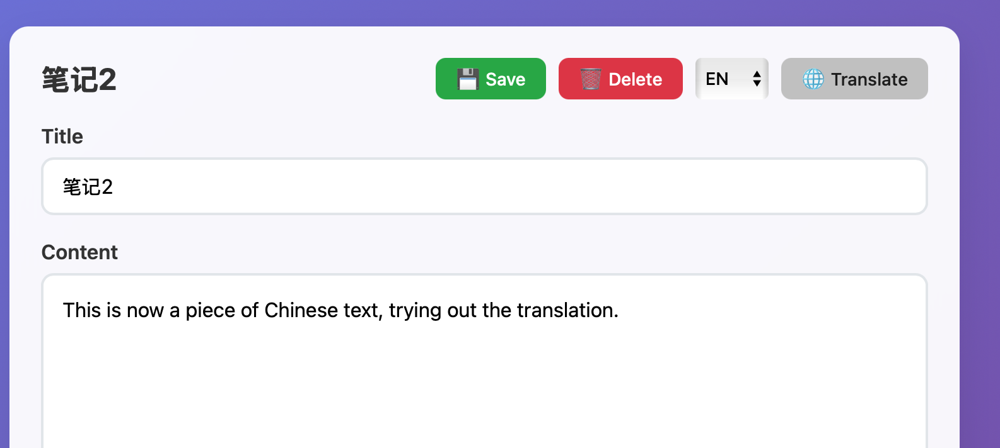
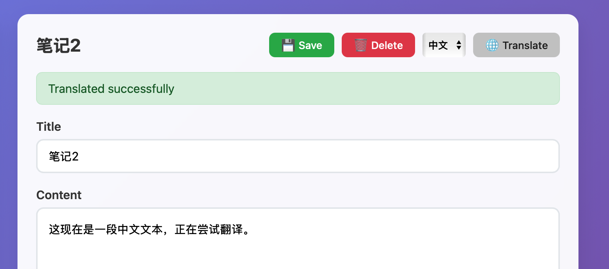

# Lab2 Development Process Record

## 1. Project Initialization and Environment Configuration

- Clone the project repository locally and navigate to the project directory.
- Install dependencies:
```bash
pip install -r requirements.txt
```
- Configure the database connection by filling in the `DATABASE_URL` provided by Supabase in the `.env` file.

---

## 2. Code Refactoring and Database Connection

- Refactored the original code into a clearer structure, separating the routes, models, and main entry point files.
- Configured SQLAlchemy to connect to the Supabase database and tested the local connection.
- Encountered a connection issue and was unable to connect to Supabase. After troubleshooting, it was because direct connection to the database does not support ipv4 , which was ultimately resolved by changing the method to connect to the transaction pooler.


---

## 3. Vercel Deployment Configuration

- Added a `vercel.json` file to specify the entry point and routing rules for the Flask application.
- Use the Vercel CLI to deploy the project. Remember to configure the `DATABASE_URL` environment variable in the Vercel backend and redeploy after setting it.
- After successful deployment, the application can be accessed through the preview URL provided by Vercel.



## 4. Adding English-Chinese Translation

- Requirement: Add a "Translate" button to the note editing interface to support English-Chinese translation and call the `gpt-4-1-mini` model from GitHub Models.
- Steps:
1. Update the backend LLM client, configuring it to call `gpt-4-1-mini` and support the target language parameter.
2. Add a `/api/translate` route to receive the text to be translated and the target language, and return the translation result.
3. Add a language selection and a "Translate" button to the frontend editing area. Clicking this button calls the backend API and automatically saves the translation result.
4. Test the functionality locally to ensure the translation button and API are working properly.



